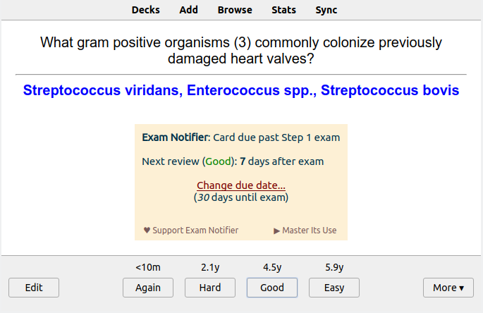

## Exam Notifier for Anki



Exam Notifier provides users with notifications that a card will appear after an upcoming exam date. This feature allows the user to determine how to answer the card (i.e. Again, Hard, Good, Easy) or determine if rescheduling the card is deemed necessary. For example, a user may struggle with a particular subject and despite their ability to answer the card correctly, that they would like to revist these cards on the days leading up to their exam.

### Table of Contents <!-- omit in toc -->

<!-- MarkdownTOC levels="1,2,3" -->

- [Installation](#installation)
- [Documentation](#documentation)
- [Building](#building)
- [Developing](#developing)
- [Contributing](#contributing)
- [License and Credits](#license-and-credits)
- [Supporting this Project](#supporting-this-project)

<!-- /MarkdownTOC -->

### Installation

#### AnkiWeb <!-- omit in toc -->

The easiest way to install Exam Notifier is through [AnkiWeb](https://ankiweb.net/shared/info/599952588).

#### Manual installation <!-- omit in toc -->

Please click on the entry corresponding to your Anki version:

<details>

<summary><i>Anki 2.1</i></summary>

1. Make sure you have the [latest version](https://apps.ankiweb.net/#download) of Anki 2.1 installed. Earlier releases (e.g. found in various Linux distros) do not support `.ankiaddon` packages.
2. Download the latest `.ankiaddon` package from the [releases tab](https://github.com/ankingmed/exam-notifier/releases) (you might need to click on *Assets* below the description to reveal the download links)
3. From Anki's main window, head to *Tools* → *Add-ons*
4. Drag-and-drop the `.ankiaddon` package onto the add-ons list
5. Restart Anki

Video summary:


</details>

### Documentation

For further information on the use of this add-on please check out [the description text](docs/description.md) for AnkiWeb.

### Building

To build Exam Notifier, you will need to have the latest development build of [Anki add-on builder](https://github.com/glutanimate/anki-addon-builder) installed, alongside Qt5 and Qt6 dependencies:

```bash
pip install --upgrade git+https://github.com/glutanimate/anki-addon-builder.git@v1.0.0-dev.1#egg=aab[qt5,qt6]
```

You also need have Node and [yarn](https://yarnpkg.com/getting-started/install) installed.

You can then proceed to build the add-on via:

    git clone https://github.com/ankingmed/exam-notifier.git
    cd exam-notifier
    make build

For more information on the build process please refer to [`aab`'s documentation](https://github.com/glutanimate/anki-addon-builder/#usage).

### Developing

You can run `make develop` to build into `/src/exam_notifier`, which you can then soft link from `addons21` directory.

Run `yarn dev`, and when you edit an existing ts/svelte file, the files are re-built automatically. (You may still need to restart Anki for the changes to take effect)

### Contributing

Contributions are welcome! Please review the [contribution guidelines](./CONTRIBUTING.md) on how to:

- Report issues
- File pull requests
- Support the project as a non-developer

### License and Credits

*Exam Notifier* is *Copyright © 2019-2022 [Aristotelis P.](https://glutanimate.com/) (Glutanimate)*

All credits for the original idea for this add-on go to to [The AnKing](https://www.ankingmed.com/).

Exam Notifier is free and open-source software. The add-on code that runs within Anki is released under the GNU AGPLv3 license, extended by a number of additional terms. For more information please see the [LICENSE](https://github.com/ankingmed/exam-notifier/blob/master/LICENSE) file that accompanied this program.

Please note that this program uses the [Libaddon](https://github.com/glutanimate/anki-libaddon/) library which comes with [its own additional terms extending the GNU AGPLv3 license](https://github.com/glutanimate/anki-libaddon/blob/master/LICENSE). You may only copy, distribute, or modify the present compilation of this program with Libaddon under the combined licensing terms specified by both licenses.

This program is distributed in the hope that it will be useful, but WITHOUT ANY WARRANTY.


----

### Supporting this Project

If you enjoy Exam Notifier, please consider supporting our work through one of the means below:

<hr>

#### Supporting Glutanimate <!-- omit in toc -->

<p align="center"><a href="https://www.patreon.com/glutanimate"></a></p>

<p align="center">Make sure to check out my socials for the latest add-on updates and news:</p>

<p align="center"><a href="https://twitter.com/glutanimate">@Glutanimate</a>&nbsp;&nbsp;&nbsp;&nbsp;|&nbsp;&nbsp;&nbsp;&nbsp;<a href="https://www.youtube.com/c/glutanimate"> / Glutanimate</a>&nbsp;&nbsp;&nbsp;&nbsp;|&nbsp;&nbsp;&nbsp;&nbsp;<a href="https://www.instagram.com/glutanimate"> / @Glutanimate</a></p>

<p align="center">Lots of <b>exclusive add-ons</b> and other goodies also await on my Patreon page. Make sure to take a look!:</p>

<p align="center">
<a href="https://www.patreon.com/glutanimate" title="❤️ Support me on Patreon"></a>&nbsp;&nbsp;&nbsp;&nbsp;&nbsp;&nbsp;&nbsp;&nbsp;&nbsp;
</p>

<hr>

#### Supporting AnKing <!-- omit in toc -->


<b>Please consider checking out our:</b>

- <a href="https://www.youtube.com/theanking/playlists" rel="nofollow">YouTube Channel</a>- <i>How to use Anki for beginners and advanced users.</i> 
- <a href="https://www.instagram.com/ankingmed" rel="nofollow">Instagram</a>/<a href="https://www.facebook.com/ankingmed" rel="nofollow">Facebook</a>: <i>@Ankingmed</i>
- <a href="https://www.ankingmed.com" rel="nofollow">www.AnKingMed.com</a>- <i>Recommended add-ons, tutorials and more including <b>how to download 40+ add-ons in &lt; 5min</b></i>
- <a href="https://www.ankipalace.com/membership" rel="nofollow">Patreon</a>- <i>Support our work and <b>get individualized Anki help!</b></i>

<p align="center">
<a href="https://www.ankingmed.com" rel="nofollow"></a><a href="https://www.ankingmed.com" rel="nofollow"></a>
  <br>
  <a href="https://www.facebook.com/ankingmed" rel="nofollow"></a>     <a href="https://www.instagram.com/ankingmed" rel="nofollow"></a>     <a href="https://www.youtube.com/theanking" rel="nofollow"></a>     <a href="https://www.tiktok.com/@ankingmed" rel="nofollow"></a>     <a href="https://www.twitter.com/ankingmed" rel="nofollow"></a>
  <br>
<a href="https://www.ankipalace.com/membership" rel="nofollow"></a>
<br>
<b>Check out our Anki Mastery Course! (The source of funding for this project)</b><br>
          <a href="https://courses.ankipalace.com/?utm_source=anking_bg_add-on&amp;utm_medium=anki_add-on_page&amp;utm_campaign=mastery_course" rel="nofollow">https://courses.ankipalace.com</a>
<a href="https://courses.ankipalace.com/?utm_source=anking_bg_add-on&amp;utm_medium=anki_add-on_page&amp;utm_campaign=mastery_course" rel="nofollow">
  <br>
  </a></p>

<hr>
